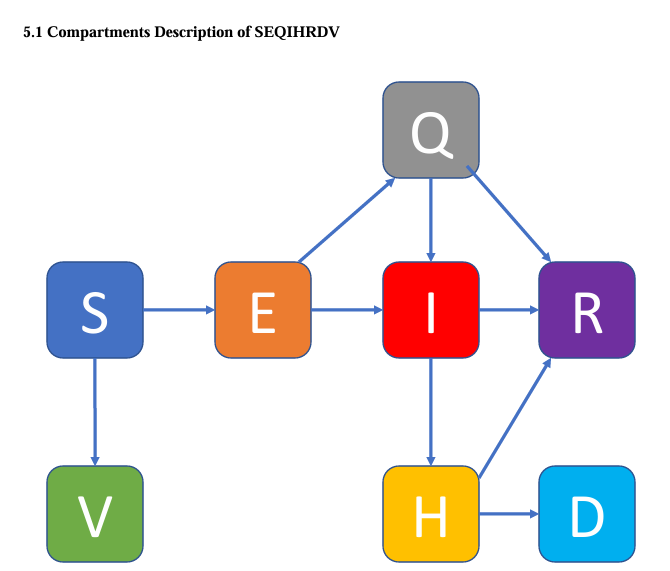
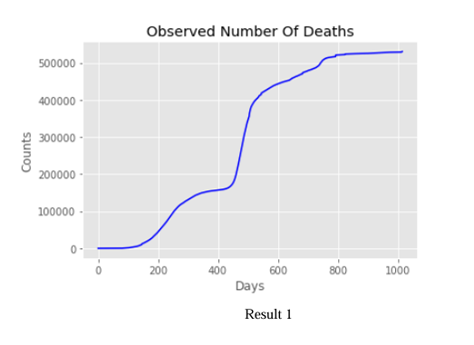
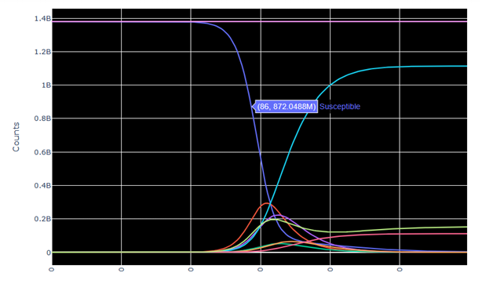

# COVID-19 Epidemiology Compartmental Model (SEQIHRDV)

This project implements a Python-based simulation of the COVID-19 pandemic using a custom-built SEQIHRDV epidemiological model. The goal is to estimate the impact of interventions (testing, quarantine, vaccination) and forecast cumulative deaths in India using real-world data.

Developed as part of the MSc Data Science program at Swansea University.

---

## 🔬 Model Overview

The model expands the basic SIR framework by introducing the following compartments:

- **S**: Susceptible  
- **E**: Exposed  
- **Q**: Quarantined  
- **I**: Infected  
- **H**: Hospitalized  
- **R**: Recovered  
- **D**: Deceased  
- **V**: Vaccinated  

Transitions between these compartments are governed by a system of ordinary differential equations (ODEs). The model uses logistic functions and curve fitting for estimating the reproduction number over time.

---

## 🛠 Technologies Used

- Python 3.x  
- `NumPy`, `Pandas`  
- `SciPy` (`odeint`)  
- `LMfit` – Levenberg-Marquardt curve fitting  
- `Matplotlib`, `Plotly` – visualization

---

## 📈 Key Features

- Implementation of SEQIHRDV ODE-based model  
- Logistic function modeling for time-varying reproduction number (R₀)  
- Parameter fitting using LMfit to match real COVID-19 death data from India  
- Scenario-based forecasting over 200+ days  
- Sensitivity analysis for vaccination and testing effectiveness  
- Visual output of compartment trends and death projections

---

## 📊 Results Summary

- **Predicted Total Deaths by Day 1016:** 2.22 million  
- **Predicted Total Deaths by Day 1200:** 3.1 million  
- **R₀ Trend:** Decreased from ~2.98 to ~0.91 over the observed period  
- Precautionary measures such as vaccination rate (omega) and testing rate (tera) were shown to significantly reduce exposed and infected populations.

---

## 📊 Visualizations

### 1. SEQIHRDV Compartment Structure
  
This diagram illustrates the transitions between compartments: Susceptible (S), Exposed (E), Quarantined (Q), Infected (I), Hospitalized (H), Recovered (R), Deceased (D), and Vaccinated (V).

---

### 2. Actual COVID-19 Death Count (India)
  
Observed cumulative death count over 1000+ days, sourced from the Humanitarian Data Exchange (HDX).

---

### 3. Core SEQIHRDV Model Behavior
  
Shows how the population distributes over time across all compartments under the SEQIHRDV model simulation.

---

### 4. Model Fit vs Real Data
.PNG)  
Comparison of actual death count and best-fit output from the model using logistic curve and LMfit optimization.

---

## 📁 Folder Structure

/model/           → model_seqihrdv.py  
/data/            → sample_dataset.csv  
/visuals/         → predictions_plot.png  
README.md  
requirements.txt  
.gitignore

